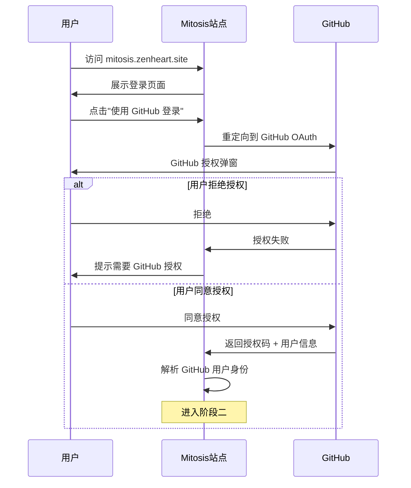
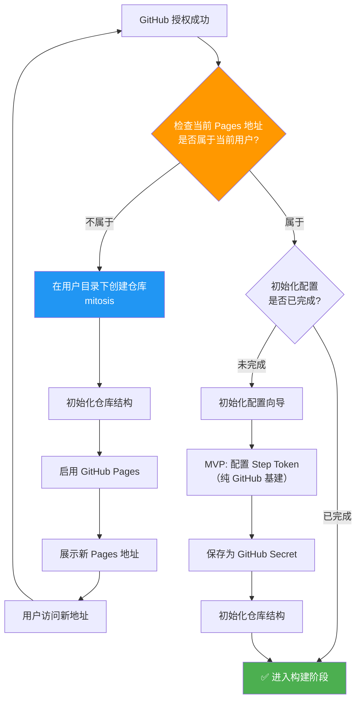
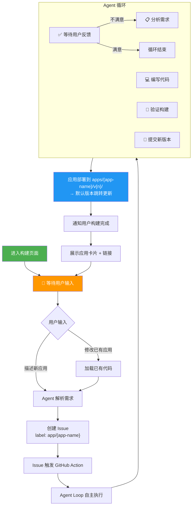
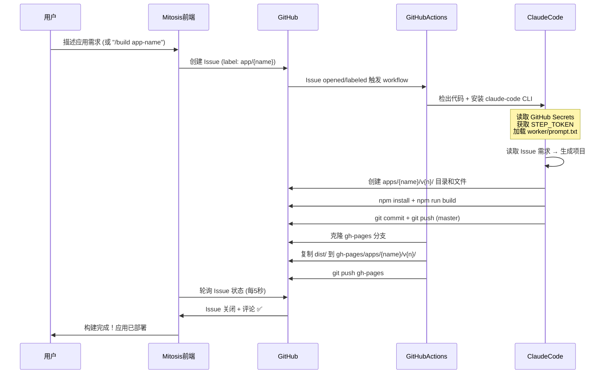
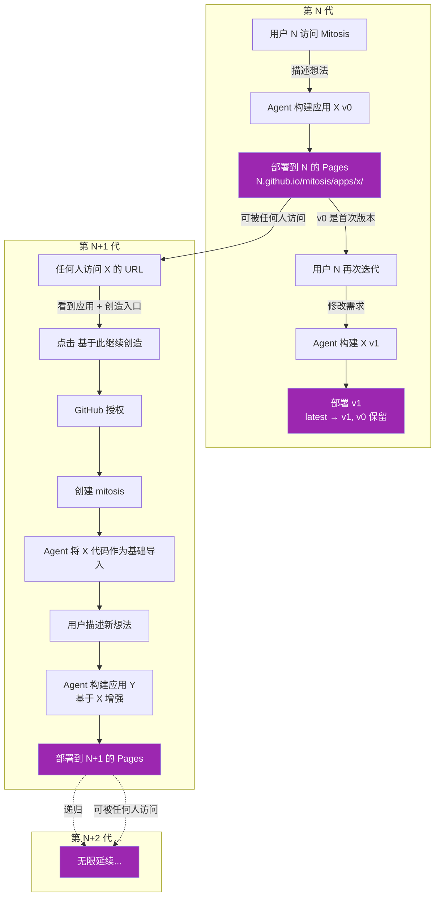

# Mitosis

> 一生二，二生三，三生万物 — AI 构建 AI，无限繁衍

[](https://mitosis.zenheart.site)
[](LICENSE)

**Mitosis** 是一个自举应用构建平台。平台本身由 Mitosis 构建，每个由 Mitosis 构建的应用，本身也是一个完整的 Mitosis 实例。用户用自然语言描述需求，Agent 自主完成规划、编码、测试和部署——形成无限自举循环。

```
第 0 步: Mitosis 构建自身
第 1 步: 用户用 Mitosis 构建应用
第 2 步: 该应用即 Mitosis，可继续构建新应用
第 N 步: 无限递归...
```

> **设计优先级：** 自举闭环（app 创建 app）是 L0 不可破坏的核心链路。所有其他功能（UI 增强、模板市场、多 LLM 支持等）均在闭环之上叠加，绝不干扰最小闭环的运行。


## 快速开始

```bash
# 1. 访问 https://mitosis.zenheart.site
# 2. 使用 GitHub 登录
# 3. 步骤二：初始化配置
#    - MVP 阶段：仅配置 Step Token（纯 GitHub 基建）
#    - 后续迭代：可选择接入云服务（服务端/数据库/自定义域名等）
# 4. 描述你想构建的应用
```

> **阶段二 — 初始化配置是可扩展的：** MVP 只需填入 Step Token，完全依赖 GitHub Pages + Actions。后续可通过初始化配置选择接入云服务（服务端运行时、数据库、存储等），让 Mitosis 构建的应用具备后端能力——平台自迭代扩展。

## OAuth 后端代理（Cloudflare Worker）

由于 GitHub Pages 是纯静态托管，浏览器无法直接调用 GitHub 的 `/login/oauth/access_token` 端点（CORS 限制）。Mitosis 使用 [Cloudflare Workers](https://developers.cloudflare.com/workers/) 部署一个轻量级 OAuth Token 兑换代理，解决此问题。

### 架构

```
┌─────────────┐     ┌──────────────────────────────────┐     ┌─────────────┐
│  浏览器 SPA  │────▶│  Cloudflare Worker (OAuth Proxy) │────▶│   GitHub    │
│  (GitHub    │     │  mitosis-oauth-proxy.workers.dev │     │  OAuth API  │
│   Pages)    │◀────│  兑换 code → access_token         │◀────│             │
└─────────────┘     └──────────────────────────────────┘     └─────────────┘
```

### 部署 OAuth Proxy Worker

Worker 源码位于本仓库的 `worker/` 目录：

```bash
cd worker

# 1. 安装依赖
npm install

# 2. 登录 Cloudflare
npx wrangler login

# 3. 设置 Secrets
npx wrangler secret put GITHUB_CLIENT_ID     # 你的 GitHub OAuth App Client ID
npx wrangler secret put GITHUB_CLIENT_SECRET # 你的 GitHub OAuth App Client Secret

# 4. 部署
npx wrangler deploy
```

### GitHub OAuth App 配置

在 [GitHub OAuth Apps](https://github.com/settings/developers) 中：

| 字段 | 值 |
|------|-----|
| Homepage URL | `https://<用户名>.github.io/mitosis` |
| Authorization callback URL | `https://<用户名>.github.io/mitosis/auth/callback` |

> **注意：** 授权流程使用 **Authorization Code Flow**（`response_type=code`），Worker 代理负责用 `client_secret` 兑换 token。


### 自动生成的仓库结构

```
mitosis/
├── .claude/
│   └── settings.json       # 初始化配置（云服务选择 + Token 引用）
├── .github/
│   └── workflows/
│       └── mitosis.yml     # 构建流水线
├── apps/                   # Agent 生成的应用（版本化）
│   └── {app-name}/
│       └── v0/             # 版本 0（初始版本）
│           ├── index.html
│           ├── vite.config.ts
│           ├── tsconfig.json
│           ├── package.json
│           └── src/
│               ├── main.ts
│               ├── App.vue
│               └── assets/
│                   └── main.css
├── src/                    # 应用源码（Vue + TS + Vite）
│   ├── main.ts
│   ├── App.vue
│   └── components/
├── index.html              # Vite 入口
├── vite.config.ts          # Vite 配置
├── tsconfig.json           # TypeScript strict 配置
├── package.json
├── .gitignore
├── LICENSE
└── README.md
```

> **技术栈锁定：** 初始版本统一使用 Vue 3 (latest) + TypeScript (strict 强类型) + Vite (latest)。源码结构包含完整 `tsconfig.json` 和 `vite.config.ts`，Agent 构建的应用必须是强类型 Vue 项目。

---

## 三阶段流程

### 阶段一：登录认证

用户访问 `mitosis.zenheart.site`，通过 GitHub OAuth 登录。站点检查当前 Pages 地址的所有者是否与登录用户一致。



---

### 阶段二：启动设置

如果 Pages 地址不属于当前用户，平台自动创建 `mitosis` 仓库并启用 Pages，用户访问新地址后回到阶段一。如果属于用户，进入初始化配置——MVP 阶段仅需配置 Step Token（纯 GitHub 基建），后续迭代可通过此环节选择接入云服务（服务端/数据库/自定义域名等）。



> **初始化配置是可扩展的：** 当前 MVP 仅需 Step Token，完全依赖 GitHub Pages + Actions。后续版本中，初始化向导可增加云服务选择（运行时、数据库、部署目标等），让 Mitosis 构建的应用具备服务端能力——平台通过自举闭环实现自迭代。

---

### 阶段三：循环构建

用户描述应用需求后，Agent 自主完成分析、编码、验证、部署的完整循环。每次迭代生成新版本（v0, v1, v2...），不覆盖已有版本。`/apps/{name}/` 始终指向最新版本，`/apps/{name}/v1/` 等可访问历史版本。用户可随时修改需求触发新一轮迭代。



---

## 工作原理

### 整体架构

Mitosis 是纯静态站点，所有逻辑围绕用户的 GitHub 仓库运转。平台本身不持有任何用户数据。

```
┌─────────────────────────────────────────────────────────┐
│                    用户层                                  │
│  ┌──────────┐  ┌──────────┐  ┌──────────────────────┐  │
│  │ 开发者 A  │  │ 开发者 B  │  │ 访客 C（查看已部署应用）│  │
│  └────┬─────┘  └────┬─────┘  └──────────┬───────────┘  │
│       │             │                    │               │
├───────┼─────────────┼────────────────────┼──────────────┤
│       │             │                    │               │
│  ┌────▼──────────────────────────────────────▼────────┐ │
│  │              GitHub Pages (Vue 3 + TypeScript + Vite)          │ │
│  │  ┌─────────┐ ┌─────────┐ ┌─────────┐ ┌──────────┐ │ │
│  │  │ 访客页  │ │ 工作空间 │ │ 对话界面 │ │ 环境配置  │ │ │
│  │  └─────────┘ └─────────┘ └─────────┘ └──────────┘ │ │
│  └────────────────────────────────────────────────────┘ │
│                          │                               │
│          ┌───────────────┼───────────────┐              │
│          │               │               │              │
│  ┌───────▼──────┐ ┌─────▼──────┐ ┌─────▼──────────┐   │
│  │ GitHub API   │ │ GitHub     │ │ GitHub Actions  │   │
│  │ (OAuth/Repo) │ │ Secrets    │ │ (CI 沙盒)       │   │
│  └──────────────┘ └────────────┘ └─────┬──────────┘   │
│                                         │                │
│                              ┌──────────▼──────────┐    │
│                              │  Claude Code CLI     │    │
│                              │  (Agent Loop)        │    │
│                              │  读取 Secrets 环境变量│    │
│                              └──────────┬──────────┘    │
│                                         │                │
│                              ┌──────────▼──────────┐    │
│                              │  apps/{name}/ 代码    │    │
│                              │  提交到用户仓库        │    │
│                              └──────────┬──────────┘    │
│                                         │                │
│                              ┌──────────▼──────────┐    │
│                              │  GitHub Pages CDN    │    │
│                              │  部署用户应用          │    │
│                              └──────────────────────┘    │
└─────────────────────────────────────────────────────────┘
```

### 技术栈

```
前端:  Vue 3 (latest) + TypeScript (strict 强类型) + Vite (latest)
构建:  GitHub Actions + Claude Code CLI
部署:  GitHub Pages
认证:  GitHub OAuth 2.0
```

> **强类型强制：** 前端代码必须使用 TypeScript strict 模式，所有组件、函数、接口必须有明确的类型定义。禁止使用 `any` 类型。

```yaml
# .github/workflows/mitosis.yml — 构建流水线
name: Mitosis Build
on:
  push:
    branches: [master]
  issues:
    types: [opened, labeled]
  issue_comment:
    types: [created]

permissions:
  contents: write
  issues: write

jobs:
  build:
    runs-on: ubuntu-latest
    steps:
      - uses: actions/checkout@v4
        with:
          fetch-depth: 0
      - uses: actions/setup-node@v4
        with: node-version: 20
      - run: npm install -g @anthropic-ai/claude-code
      - name: Parse app name and version
        id: parse
        env:
          ISSUE_LABELS: ${{ toJson(github.event.issue.labels) }}
          ISSUE_TITLE: ${{ github.event.issue.title }}
        run: |
          APP_NAME=$(echo "$ISSUE_LABELS" | grep -oP 'app/\K[^"]+' | head -1)
          echo "app_name=$APP_NAME" >> $GITHUB_OUTPUT
          # ... version calculation
      - name: Run Agent Loop
        if: ${{ steps.parse.outputs.app_name != 'unknown' }}
        env:
          ANTHROPIC_API_KEY: ${{ secrets.STEP_TOKEN }}
          ANTHROPIC_BASE_URL: https://api.stepfun.com/step_plan
          APP_NAME: ${{ steps.parse.outputs.app_name }}
        run: |
          PROMPT=$(sed \
            -e "s/__APP_NAME__/${{ steps.parse.outputs.app_name }}/g" \
            -e "s/__NEXT_VERSION__/${{ steps.parse.outputs.version }}/g" \
            worker/prompt.txt)
          claude -p \
            --model step-3.7-flash \
            --allowed-tools "Read,Write,Edit,Bash" \
            --max-turns 80 \
            --output-format text \
            "$PROMPT"
      - name: Commit and push
        if: ${{ steps.parse.outputs.app_name != 'unknown' }}
        env:
          APP_NAME: ${{ steps.parse.outputs.app_name }}
        run: |
          git config user.name "mitosis-bot"
          git config user.email "mitosis@users.noreply.github.com"
          cd apps/$APP_NAME/$NEXT_VERSION
          git init && git add -A
          git commit -m "feat: build $APP_NAME $NEXT_VERSION (issue #...)"
          git push -u origin master
      - name: Deploy to GitHub Pages
        if: ${{ steps.parse.outputs.app_name != 'unknown' }}
        run: |
          git clone --branch gh-pages /tmp/gh-pages
          cp -r apps/$APP_NAME/$NEXT_VERSION/dist/* /tmp/gh-pages/apps/$APP_NAME/$NEXT_VERSION/
          cd /tmp/gh-pages && git add -A && git commit && git push
      - name: Close issue
        if: ${{ github.event_name == 'issues' }}
        run: |
          gh issue close ${{ github.event.issue.number }} \
            --repo ${{ github.repository }} \
            --comment "✅ 构建完成！访问: https://mitosis.zenheart.site/apps/$APP_NAME/"
```

> **版本化策略：** 每次构建生成新版本目录 `v0`, `v1`, `v2`...，不覆盖已有版本。部署结构为 `apps/{name}/v{n}/`，URL 为 `https://mitosis.zenheart.site/apps/{name}/v{n}/`。

### 构建时序



> **版本化：** 每次迭代生成新版本目录（v0, v1, v2...），不覆盖已有版本。`/apps/{name}/` → `latest/` → 最新版本，`/apps/{name}/v1/` 等可访问历史版本。

---

## 自举循环

每个创建的应用，本身就是一个完整的 Mitosis 实例——自带 `.claude/settings.json` 和 `.github/workflows/mitosis.yml`。任何访客访问已部署的应用后，都可以基于它继续创造新的应用，形成无限代际链。

版本化部署确保每次迭代都有迹可循：`/apps/{name}/` 始终指向最新版本，`/apps/{name}/v0/` `/v1/` 等可访问历史快照。

> **技术栈说明：** 初始版本统一使用 Vue 3 (latest) + TypeScript (strict 强类型) + Vite (latest)。Mitosis 的自举机制不限制后续应用的技术栈——通过初始化配置选择云服务后，Agent 可生成对应技术栈的项目结构。



### 设计优先级

| 层级 | 内容 | 原则 |
|------|------|------|
| **L0 核心** | 自举闭环 — 应用创建应用 + 版本化部署 | 不可破坏，所有功能在此之上叠加 |
| **L1 扩展** | 用户在闭环基础上扩展应用功能 | 版本管理、多轮迭代、模板市场、云服务集成 |
| **L2 增强** | Mitosis 平台自身能力增强 | 多 LLM、自定义 Agent、团队协作、插件系统 |

> **铁律：** L0 闭环是系统存在的前提。任何 L1/L2 的改动都不能影响最小闭环的完整性和可用性——即"GitHub 授权 → 初始化配置 → 创建 Issue → Actions 触发 → Claude CLI 构建 → 版本化部署 → 应用即 Mitosis"这一链路必须始终畅通。初始化配置环节的可扩展性（从纯 GitHub 到云服务集成）是平台自迭代的核心机制。

---

## 架构设计

### 设计决策

| 决策 | 理由 |
|------|------|
| 用户自持 GitHub 仓库 | 平台不持有任何用户代码或 Token |
| GitHub Actions 构建引擎 | 复用 GitHub CI，无需独立后端 |
| Claude Code CLI 作为 Agent | 完整仓库访问，无需额外封装 |
| 纯静态 HTML/CSS/JS 输出 | 零依赖，最大可移植性 |
| Issue 驱动构建触发 | GitHub 原生事件，无需自定义 Webhook |

### 核心数据流

```
用户输入 → GitHub Issue → GitHub Actions → Claude Code CLI
                                                    ↓
                                            写入代码到 apps/{name}/
                                                    ↓
                                              commit → push
                                                    ↓
                                              GitHub Pages
                                                    ↓
                            https://{u}.github.io/mitosis/apps/{name}/
```

---

## 约束条件

| 约束 | 说明 |
|------|------|
| 输出类型 | MVP 阶段为纯静态 Web 应用（HTML/CSS/JS，零依赖）；后续可通过初始化配置扩展服务端、移动端、桌面端等场景 |
| 部署目标 | MVP 为 GitHub Pages；后续支持其他部署目标 |
| 后端 | MVP 无后端；初始化配置可启用服务端运行时 |
| 多用户协作 | MVP 不支持；后续可通过组织/团队配置启用 |
| 应用类型 | MVP 仅 Web；通过配置可覆盖服务端 API、移动端、桌面端等 |

> Mitosis 的架构设计确保每次能力扩展都通过自举闭环完成——Mitosis 构建新版本的自己，实现自迭代。

### 最小闭环定义（MVP）

Mitosis 的 MVP 仅需验证纯 Web 应用的以下链路完整跑通：

```
用户描述需求 → 创建 Issue → GitHub Actions 触发
→ Claude Code 构建应用 → 提交代码 → Pages 部署
→ 部署后的应用自带 Mitosis 能力 → 下一个人可继续创造
```

MVP 闭环跑通后，通过在初始化环节添加服务端配置、运行时选择、部署目标等，Mitosis 可通过自举闭环自主迭代扩展至服务端、移动端、桌面端等更多场景。

---

## 本地开发

```bash
git clone https://github.com/zenheart/mitosis.git
cd mitosis
npm install
npm run dev     # 本地预览
npm run build   # 生产构建
```

---

## 路线图

| 阶段 | 状态 | 内容 |
|------|------|------|
| **1 — MVP** | ✅ | 纯 Web 应用最小闭环：OAuth、自动仓库 + Pages、环境配置、GitHub Actions 构建、自举循环 |
| **2 — 自迭代扩展** | ⬜ | 通过在初始化环节添加服务端/运行时/部署目标等配置，Mitosis 自主构建扩展自身能力的版本（服务端 API、移动端、桌面端等） |
| **3 — 生态** | ⬜ | 多 LLM、自定义 Agent、团队协作、插件系统、模板市场 |

---

## 贡献

1. Fork → 创建 `mitosis` → 提出修改 → 提交 PR

## License

MIT

---

## 核心约束

| # | 约束 | 说明 |
|---|------|------|
| 1 | **安全第一** | 所有 Token 和隐私信息充分利用 GitHub 原生能力（Secrets、加密仓库、OAuth），平台不持有任何用户敏感数据，杜绝泄露风险 |
| 2 | **自迭代优先** | Mitosis 可基于自身构建新版本，实现自举迭代——平台自身的改进也通过自举闭环完成 |
| 3 | **纯 GitHub 驱动** | 完全依托 GitHub 原生能力：Issue 管理任务、GitHub Actions 执行 Agent 循环、GitHub Pages 部署，不引入外部基础设施 |
| 4 | **版本化部署** | 每次迭代构建生成新版本（v0, v1, v2...），不覆盖已有版本。`/apps/{name}/` 默认指向最新版，`/apps/{name}/v{n}/` 可访问历史版本 |
| 5 | **初始化可扩展** | 阶段二初始化配置是可扩展的——MVP 仅配置 Step Token（纯 GitHub 基建），后续可在此环节选择接入云服务（服务端运行时、数据库、存储、自定义域名等），让 Mitosis 构建的应用具备后端能力 |
| 6 | **自愈与恢复** | 构建失败可自动纠正并重试，支持定时自检机制——异常状态能被检测并恢复，无需人工介入 |
| 7 | **访客可用** | 未登录用户可直接访问已部署的应用并正常使用，登录后才具备创建/修改能力 |
| 8 | **GitHub + StepFun 全栈能力利用** | 充分利用 GitHub 原生能力（OAuth、Actions、Pages、Secrets、API）与 StepFun 全栈能力（Step 模型、Agent 工具链、MCP 等）的组合，不拘泥于单一 API 调用——平台能做什么，Mitosis 就用什么，持续关注 [StepFun 文档](https://platform.stepfun.com/docs/zh/step-plan/overview) 中新能力的发布 |
| 9 | **自迭代扩展** | MVP 阶段聚焦纯 Web 应用跑通最小闭环，后续通过在初始化环节添加服务端/运行时/部署目标等配置，Mitosis 可自主构建扩展自身能力的版本——自举闭环不仅构建应用，也构建平台自身 |

## 项目起源

Mitosis 诞生于 **候鸟 AI 创造局**（StepFun 开发者活动，2026/6/16–6/28）的背景下。

作为活动参与者，领取到 Step 3.7 Flash 调用额度后，我带着两个明确的目标开始：

1. **证明自己使用 AI 的能力** — 不满足于做一个能跑的 demo，而是用 AI 端到端地完成一个复杂项目的设计、编码和部署，展示完整工作流。探索 Agent 的边界到底在哪里？
2. **打造 StepFun 官方 Showcase** — 构建一个足够有深度和价值的产品，充分压测 StepFun 的模型在 Agent 下的能力边界，作为候鸟 AI 创造局的 showcase 作品提交。

Mitosis 就是这样诞生的。