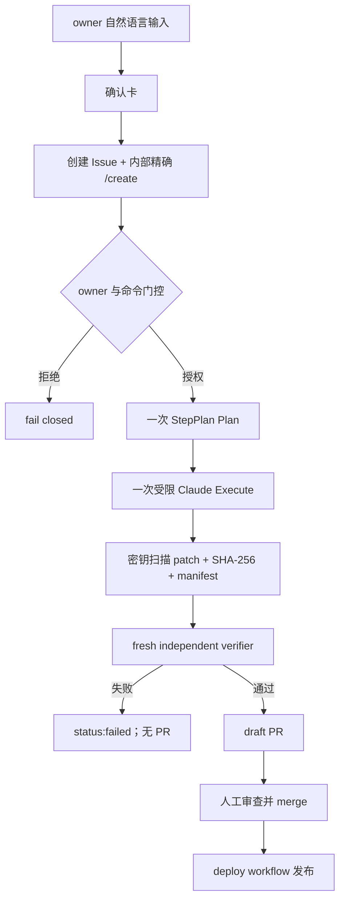

# CI Agent Loop

本文档描述 `.github/workflows/mitosis.yml` 的当前远程自举契约。本地 `/goal` 是开发者工作流，不参与这条 CI 信任链。

## MVP 用户入口

owner 在 Workspace 输入自然语言。平台完成意图分流并展示确认卡；只有 owner 明确确认后，前端才创建带 `app/{app-name}` 或 `platform` label 的 Issue，并在后台追加内容严格等于 `/create` 的评论。普通用户不需要知道或输入该内部命令。

workflow 对 actor、Issue 类型和评论内容做 fail-closed 校验：只有仓库 owner 的精确 `/create` 评论，或 owner 发起且指定 Issue 的 `workflow_dispatch`，才能进入生成 job。`owner-approved` label 不是触发条件。

## 单轮 Plan → Execute

每次授权运行只有一次规划和一次执行，不存在 verifier 反馈重试、自触发下一轮或复用同一分支继续生成：

1. **StepPlan Plan**：`step-3.7-flash` 只读受保护的 Issue 与授权目标，按 JSON schema 生成 1–6 个任务；失败即整轮失败关闭，不降级为另一个模型或计划。
2. **Claude Execute**：同一 Step Plan 模型通过 Claude Code 的 Anthropic 兼容接口执行一次受限编辑。进程使用 `--safe-mode`、空 setting sources、空 MCP 配置和无会话持久化；只允许 `Read,Write,Edit,Glob,Grep`，明确禁用 shell、网络搜索/抓取、子 Agent、项目技能和 notebook 编辑。
3. Execute 没有 GitHub 写凭据，只能修改 trusted metadata 授权的目标目录；平台任务和应用任务的可写路径分别受 root-owned policy 与 ACL 限制。

## Step Plan-only 端点

- Claude Code：`ANTHROPIC_BASE_URL` 必须使 Claude 客户端最终请求只能到 `https://api.stepfun.com/step_plan/v1/messages`。
- Workspace 聊天：只能到 `https://api.stepfun.com/step_plan/v1/chat/completions`。
- 禁止 StepFun 根域下任何普通 `/v1/...` API 路径；workflow 在暴露 `STEP_TOKEN` 前先运行端点静态门控。

## 候选交付与独立验证

生成 job 不上传 Issue、prompt、plan/model response、执行日志、源码目录或 verifier 日志。唯一可跨 job 传递的 artifact 是：

- `candidate.patch`：限制大小和授权路径，并扫描新增行中的密钥；
- `candidate.patch.sha256`：候选补丁的 SHA-256；
- `candidate.manifest.json`：base SHA、Issue、仓库、run id/attempt、变更路径和补丁 hash。

artifact 保留 **1 天**。fresh verifier job 重新 checkout 精确的不可变 base，用 base commit 中保存的 artifact helper 和 verifier 校验 manifest/hash/路径并应用同一补丁。verifier 没有 `STEP_TOKEN`、没有内容写权限，候选代码在无外网 namespace 中运行。任何校验或测试失败都标记 `status:failed`，不会生成可合并结果。

独立验证通过后，publish job 再次校验 default branch 仍等于授权 base，应用已验证 artifact，推送新分支并创建真实 draft PR。只有人工将 PR 合入 `master` 后，deploy workflow 才会发布。

## CI 执行流程



## 失败与状态

- Plan、Execute、artifact 校验、verifier 或发布任一环节失败，本轮立即失败关闭；修复要求由 owner 重新确认并发起新的独立运行。
- verifier 通过前不得 commit、push 或创建 PR；通过后仍只创建 draft PR。
- 默认分支在验证后发生变化时拒绝发布陈旧候选。

## Issue 状态

| 状态 label | 含义 |
|------------|------|
| `status:building` | Agent 正在生成应用 |
| `status:verifying` | verifier 正在运行 |
| `status:review` | 自动验证通过，等待人工审查 |
| `status:failed` | 自动生成或验证失败 |
| `owner-approved` | 预留：owner 批准外部 IssueOps 请求；当前 workflow 未把它作为触发条件 |

## Verifier

`worker/verify-build.sh` 从生成应用目录运行：

```bash
cd apps/{name}/v{n}
bash ../../../worker/verify-build.sh
```

最低门控：

- 必要文件存在。
- `dist/index.html` 和 assets 存在。
- 生成应用 Vite `base: './'`。
- TypeScript strict。
- 页面可加载。
- 关键交互有响应。
- 游戏/工具类应用满足对应 P1 标准。
