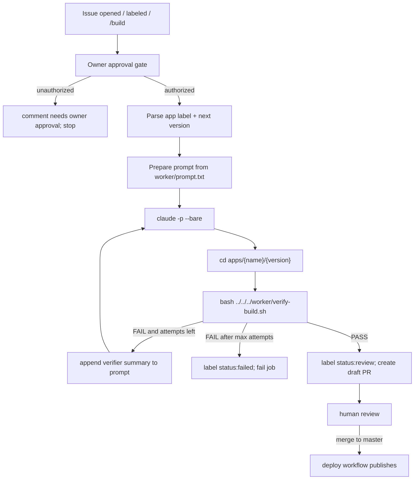

# CI Agent Loop

本文档描述 GitHub Actions 中的 Agent Loop。它不同于本地 Claude Code `/goal` loop。

## 两条 Loop 路径

| 场景 | 入口 | 可用能力 | 验证方式 |
|------|------|----------|----------|
| 本地 Claude Code | `CLAUDE.md` + `.claude/skills/setgoal/SKILL.md` + `/goal` | hooks、MCP、subagent、project memory | verifier + Stop Hook |
| GitHub Actions CI | `.github/workflows/mitosis.yml` | `claude -p --bare` | 显式 shell loop + `worker/verify-build.sh` |

`--bare` 会跳过 hooks、skills、plugins、MCP、auto memory 和 `CLAUDE.md`/`.claude/skills/*` 自动发现。因此 CI 不能依赖本地规则或本地 verifier 自动运行。

本地 `.claude/settings.json` 禁用 bypass permissions 以保护开发环境；CI 在隔离的 GitHub runner 中使用 `--bare` 并显式传入 `--permission-mode bypassPermissions`、`--allowed-tools` 和 verifier 命令。两条路径共享验收合同，但不共享本地自动发现配置。

## 执行原则

- 目标来自 `goal.md`。
- 范围来自 `goal.md`。
- 验收来自 `goal.md`、`docs/goals/acceptance.md`、`docs/quality.md`。
- 当前 goal 未完成前，不新增自发任务。

## 执行步骤

1. 读 `goal.md`，列出验收 checklist。
2. 读必要文档，不通读无关历史。
3. 做最小修改。
4. 运行验证命令。
5. 根据 verifier 结果决定：
   - PASS：更新 backlog/archive，输出结果。
   - FAIL：修复失败项，重新验证。
   - BLOCKED：说明阻塞证据和下一步，不伪装通过。

## 本地 /goal

本地 Claude Code 可以使用 `CLAUDE.md`、`.claude/rules/*.md`、hooks、MCP、subagent。

Stop Hook 阻止结束时应使用：

```json
{
  "decision": "block",
  "reason": "Verifier failed. Continue fixing the listed issues."
}
```

或者：

```json
{
  "hookSpecificOutput": {
    "hookEventName": "Stop",
    "additionalContext": "Verifier failed. Continue fixing the listed issues."
  }
}
```

不要用 `continue:false` 作为失败回环机制；它会停止处理，且 `stopReason` 不会反馈给模型继续修。

## CI 输入

- GitHub Issue 正文：生成应用的唯一权威规格。
- Issue label：`app/{app-name}`。
- 安全门控：Issue 作者必须是仓库 owner，或由仓库 owner 用 `/build`/`owner-approved` 批准。
- `worker/prompt.txt`：构建指令模板。
- GitHub Secrets：`STEP_TOKEN`。

## CI 执行流程



## CI 命令形状

```bash
claude -p \
  --model step-3.7-flash \
  --bare \
  --permission-mode bypassPermissions \
  --max-budget-usd 5 \
  --allowed-tools "Read,Write,Edit,Bash" \
  --max-turns 80 \
  --output-format text \
  "$PROMPT"

cd "apps/$APP_NAME/$NEXT_VERSION"
bash ../../../worker/verify-build.sh
```

## Retry Policy

- 最多 3 次 Agent 尝试。
- 每次 verifier 失败后，将失败摘要追加到下一轮 prompt。
- 3 次仍失败则 CI 失败。
- verifier 通过前不得 commit、push、deploy。
- verifier 通过后只创建 draft PR；合入 `master` 后才部署。

## Issue 状态

| 状态 label | 含义 |
|------------|------|
| `status:building` | Agent 正在生成应用 |
| `status:verifying` | verifier 正在运行 |
| `status:review` | 自动验证通过，等待人工审查 |
| `status:failed` | 自动生成或验证失败 |
| `owner-approved` | owner 批准外部 IssueOps 请求 |

## Verifier

`worker/verify-build.sh` 从生成应用目录运行：

```bash
cd apps/{name}/v{n}
bash ../../../worker/verify-build.sh
```

最低门控：

- 必要文件存在。
- `dist/index.html` 和 assets 存在。
- 生成应用 Vite `base: './'`。
- TypeScript strict。
- 页面可加载。
- 关键交互有响应。
- 游戏/工具类应用满足对应 P1 标准。
