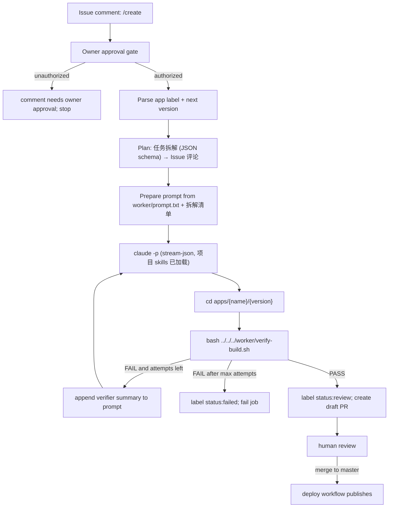

# CI Agent Loop

本文档描述 GitHub Actions 中的 Agent Loop。它不同于本地 Claude Code `/goal` loop。

## 两条 Loop 路径

| 场景 | 入口 | 可用能力 | 验证方式 |
|------|------|----------|----------|
| 本地 Claude Code | `CLAUDE.md` + `.claude/skills/setgoal/SKILL.md` + `/goal` | hooks、MCP、subagent、project memory | verifier + Stop Hook |
| GitHub Actions CI | `.github/workflows/mitosis.yml` | `claude -p`（非 bare，加载项目 CLAUDE.md/settings/skills） | 显式 shell loop + `worker/verify-build.sh` / `main-pipeline.sh` |

CI 的 `claude -p` **不使用 `--bare`**：runner 已通过 `~/.claude.json` 预信任工作区，因此项目的 `CLAUDE.md`、`.claude/settings.json`、`.claude/skills/*`（如 security-audit）在无头模式下同样加载——这是"预装技能"能力的来源。跳过加载的是各开发者本机的 `~/.claude` 个人配置（runner 上不存在）。

本地 `.claude/settings.json` 禁用 bypass permissions 以保护开发环境；CI 在隔离的 GitHub runner 中显式传入 `--permission-mode bypassPermissions`、`--allowed-tools` 和 verifier 命令。两条路径共享验收合同。

## 两阶段执行（Plan → Execute）

1. **Plan 阶段**：`STEP_PLAN_MODEL`（默认 `step-3.7-flash`）读取 Issue + 仓库现状，产出 JSON schema 约束的任务拆解（1-6 个可独立验证的任务），以 🧭 评论回写到 Issue。拆解失败自动降级为单任务。
2. **Execute 阶段**：`STEP_MODEL`（默认 `step-3.7-flash`）携带拆解清单执行，最多 3 次尝试，每次失败把 verifier 摘要作为反馈注入下一轮。

## 自举循环（多轮迭代）

owner 通过 `workflow_dispatch` 设置 `rounds_left > 0` 可开启多轮自迭代（仅 platform 构建）：每轮成功后 workflow 用 `gh workflow run` 自触发下一轮，`rounds_left` 递减，后续轮在同一分支续跑、复用同一 draft PR。停止条件（任一满足）：轮次耗尽 / Issue 关闭 / `status:stopped` 标签。人工审查（merge draft PR）始终是唯一发布闸门。

## 关键日志

- claude 输出使用 `--output-format stream-json --verbose`，经 `scripts/ci/claude-stream-log.py` 实时转为可读日志（turn/工具调用/文本摘要 + RESULT 统计行）
- 原始 NDJSON 事件流、prompt、拆解 JSON、verifier 日志均作为 artifact 保留 7 天
- 任务拆解与 verifier 结果写入 `$GITHUB_STEP_SUMMARY`；拆解清单与状态流转评论到 Issue

## 执行原则

- 目标来自 `goal.md`。
- 范围来自 `goal.md`。
- 验收来自 `goal.md`、`docs/goals/acceptance.md`、`docs/quality.md`。
- 当前 goal 未完成前，不新增自发任务。

## 执行步骤

1. 读 `goal.md`，列出验收 checklist。
2. 读必要文档，不通读无关历史。
3. 做最小修改。
4. 运行验证命令。
5. 根据 verifier 结果决定：
   - PASS：更新 backlog/archive，输出结果。
   - FAIL：修复失败项，重新验证。
   - BLOCKED：说明阻塞证据和下一步，不伪装通过。

## 本地 /goal

本地 Claude Code 可以使用 `CLAUDE.md`、`.claude/rules/*.md`、hooks、MCP、subagent。

Stop Hook 阻止结束时应使用：

```json
{
  "decision": "block",
  "reason": "Verifier failed. Continue fixing the listed issues."
}
```

或者：

```json
{
  "hookSpecificOutput": {
    "hookEventName": "Stop",
    "additionalContext": "Verifier failed. Continue fixing the listed issues."
  }
}
```

不要用 `continue:false` 作为失败回环机制；它会停止处理，且 `stopReason` 不会反馈给模型继续修。

## CI 输入

- GitHub Issue 正文：生成应用或平台变更的唯一权威规格。
- Issue label：应用构建使用 `app/{app-name}`；平台变更使用 `platform`。
- 当前触发：Issue 评论包含 `/create`。
- 安全门控：当前 workflow 只允许仓库 owner 发送 `/create` 触发 Agent Loop。
- 预留但未接线：`owner-approved` label 目前不能单独触发 Agent Loop，除非 workflow 后续实现并验证。
- `worker/prompt.txt`：构建指令模板。
- GitHub Secrets：`STEP_TOKEN`。

## CI 执行流程



## CI 命令形状

```bash
claude -p \
  --model "$STEP_MODEL" \
  --permission-mode bypassPermissions \
  --max-budget-usd 50 \
  --allowed-tools "Read,Write,Edit,Bash,Glob,Grep,Skill" \
  --max-turns 50 \
  --output-format stream-json \
  --verbose \
  --prompt-file "$PROMPT_FILE" \
  | tee "$CLAUDE_LOG" \
  | python3 scripts/ci/claude-stream-log.py

cd "apps/$APP_NAME/$NEXT_VERSION"
bash ../../../worker/verify-build.sh
```

## Retry Policy

- 最多 3 次 Agent 尝试。
- 每次 verifier 失败后，将失败摘要追加到下一轮 prompt。
- 3 次仍失败则 CI 失败。
- verifier 通过前不得 commit、push、deploy。
- verifier 通过后只创建 draft PR；合入 `master` 后才部署。

## Issue 状态

| 状态 label | 含义 |
|------------|------|
| `status:building` | Agent 正在生成应用 |
| `status:verifying` | verifier 正在运行 |
| `status:review` | 自动验证通过，等待人工审查 |
| `status:failed` | 自动生成或验证失败 |
| `owner-approved` | 预留：owner 批准外部 IssueOps 请求；当前 workflow 未把它作为触发条件 |

## Verifier

`worker/verify-build.sh` 从生成应用目录运行：

```bash
cd apps/{name}/v{n}
bash ../../../worker/verify-build.sh
```

最低门控：

- 必要文件存在。
- `dist/index.html` 和 assets 存在。
- 生成应用 Vite `base: './'`。
- TypeScript strict。
- 页面可加载。
- 关键交互有响应。
- 游戏/工具类应用满足对应 P1 标准。

## UX Review Engine

功能验收通过后，使用 Review Engine 持续打磨体验。详见 [.claude/skills/setgoal/review-engine/README.md](../.claude/skills/setgoal/review-engine/README.md)。

### 本地触发

```
/ux-polish           # 增量模式（默认）
/ux-polish full      # 全量模式
/ux-polish --files ChatInput.vue  # 指定文件增量
```

### CI 触发

在 PR 中评论：
```
/ux-check           # 增量模式
/ux-check full      # 全量模式
```

### 审计架构

| 执行模式 | 后端 | 触发方式 |
|---------|------|---------|
| 本地 setgoal | Claude subagent | Phase C 自动调用 |
| 本地手动 | Agent skill | `/ux-polish` |
| CI PR | Node.js scripts | PR comment `/ux-check` |

**评分标准：** `rubric.json` 唯一真实来源，被本地和远程共同消费。

**审计团队：**
- `ux-interaction-auditor` — 交互体验（权重 40%）
- `ux-visual-auditor` — 视觉设计（权重 30%）
- `ux-responsive-auditor` — 响应式（权重 30%）
- `ux-lead-auditor` — 首席审计员（协调、去重、报告）
