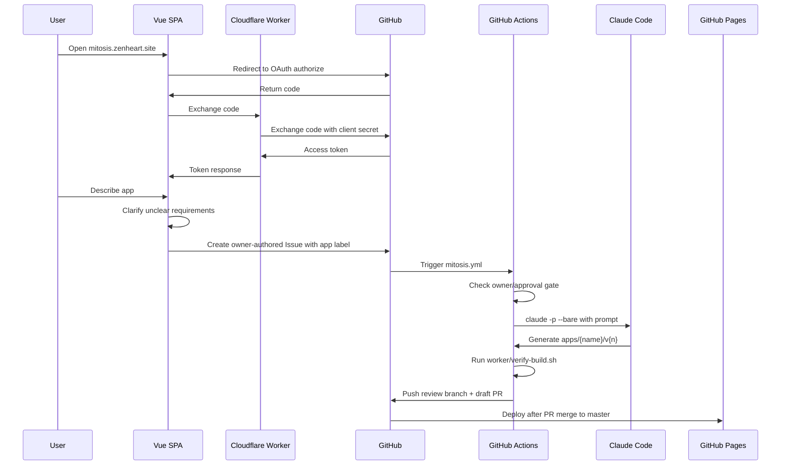
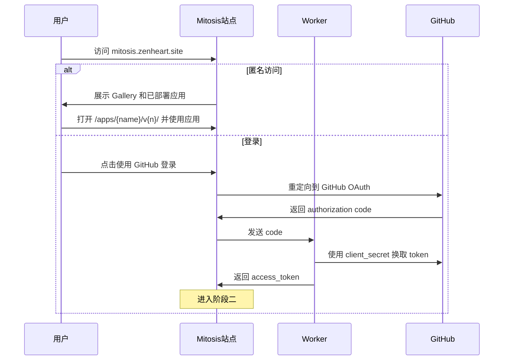
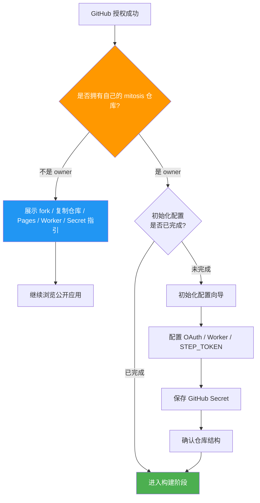
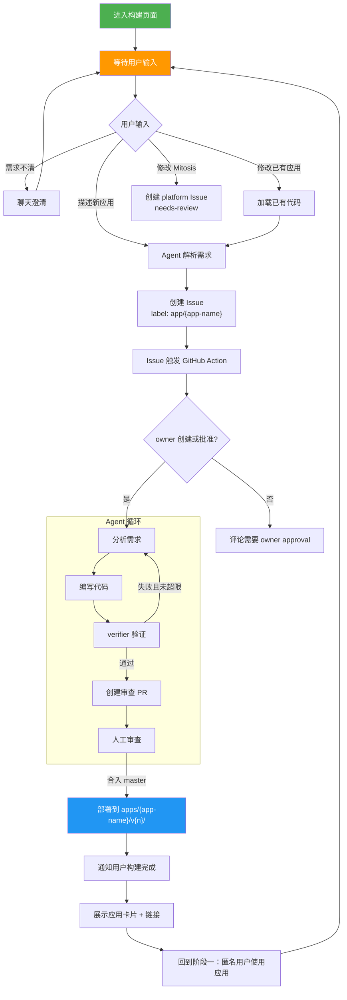
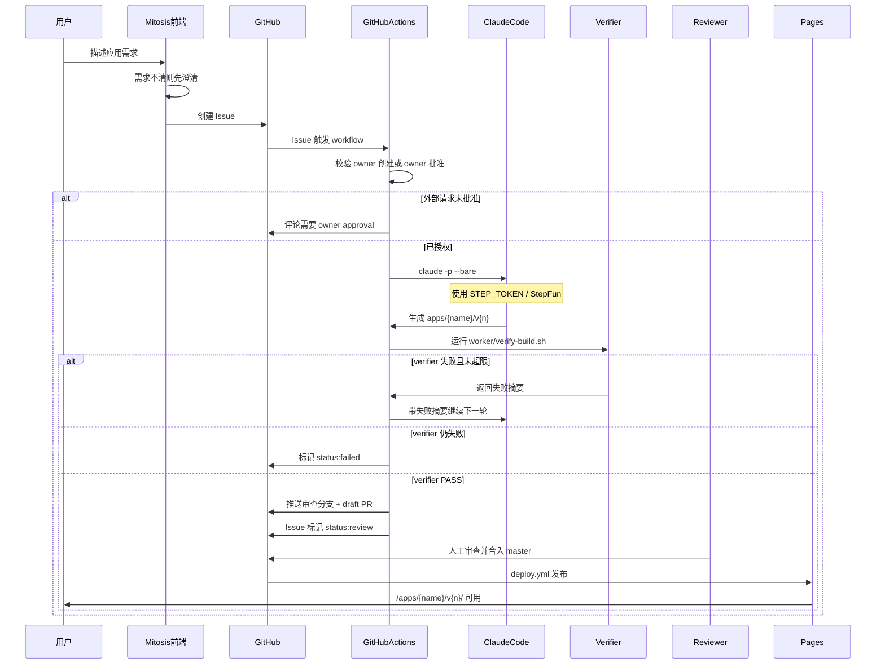
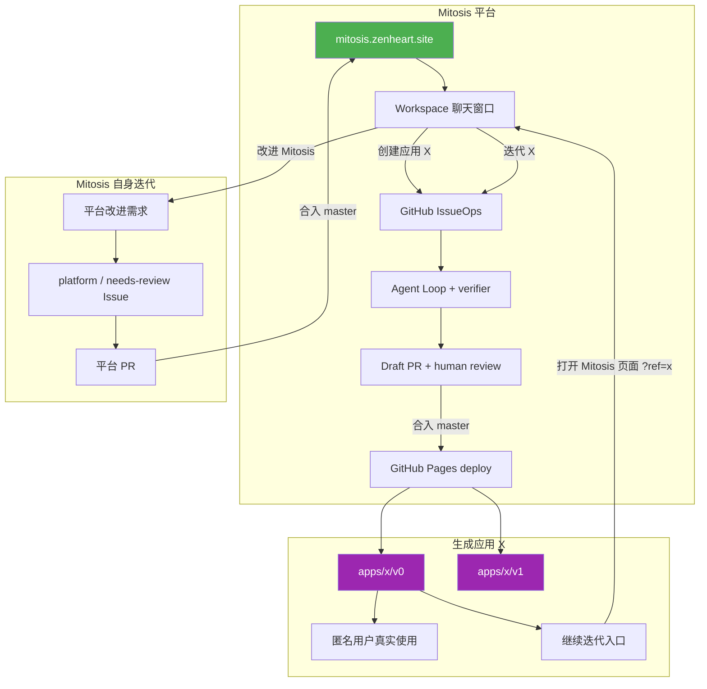
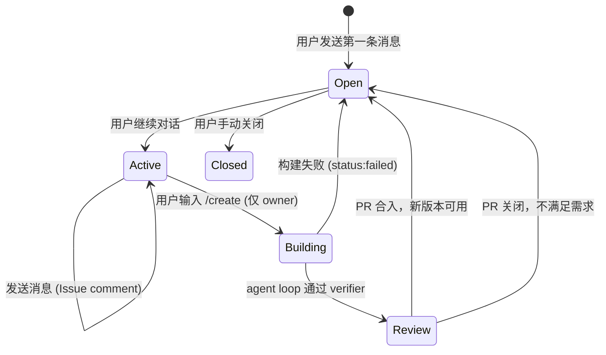
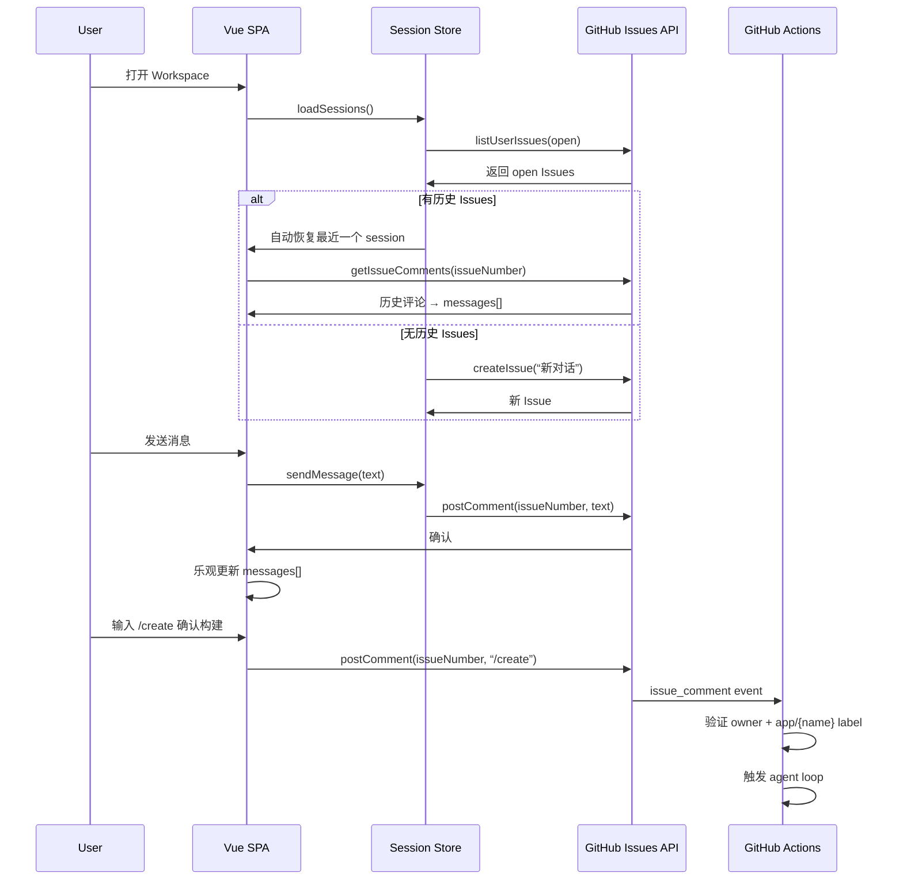

# Architecture

## 当前代码结构

```text
mitosis/
├── CLAUDE.md                  # Claude Code 官方项目入口
├── .claude/                   # Claude Code 项目共享设置和规则
│   ├── settings.json
│   └── rules/
├── src/                       # Vue 3 + TypeScript 平台源码
│   ├── components/            # Login, Setup, Workspace, Gallery
│   ├── composables/           # auth, GitHub API, polling, StepFun
│   ├── stores/                # Pinia auth state
│   └── types/                 # Auth/App 类型
├── worker/                    # Cloudflare Worker + prompt + verifier
├── apps/                      # Agent 生成应用
├── docs/                      # 长期核心文档
├── agent/                     # Agent 执行文档
└── .github/workflows/         # GitHub Actions
```

## 端到端数据流



## 权威规格

- 平台开发任务以 `goal.md` 为当前权威目标。
- 生成应用任务以 GitHub Issue 正文为唯一权威规格。
- 外部用户 Issue 不能直接触发 Agent Loop；owner 必须批准。
- `worker/prompt.txt` 是 CI 中给 Claude Code 的构建指令模板。
- `worker/verify-build.sh` 是生成应用部署前的最低质量门控。

## Vite base 语义

- 平台主站使用 `base: '/'`，因为 `mitosis.zenheart.site` 通过 CNAME 部署到根路径。
- Agent 生成应用使用 `base: './'`，因为应用产物部署到 `/apps/{name}/v{n}/`，需要相对资源路径。

## 三阶段用户流程

### 阶段一：匿名使用应用

用户访问 `mitosis.zenheart.site`。匿名用户可以浏览 Gallery 并真实使用已部署应用。只有当用户想创建或迭代应用时，才进入 GitHub OAuth 登录。



### 阶段二：登录鉴权与仓库归属

如果登录用户没有自己的可用 `mitosis` 仓库，平台只提供公开应用浏览和 fork/复制到自己仓库的指引；如果拥有自己的 `mitosis` 仓库，进入初始化配置。MVP 阶段需要 GitHub OAuth App、Cloudflare Worker 和 `STEP_TOKEN`，后续迭代可通过此环节选择接入云服务（服务端/数据库/自定义域名等）。



初始化配置是可扩展的：当前 MVP 使用 GitHub Pages + Issues + Actions、Cloudflare Worker 和 StepFun。后续版本中，初始化向导可增加云服务选择（运行时、数据库、部署目标等），让 Mitosis 构建的应用具备服务端能力，平台通过自举闭环实现自迭代。

### 阶段三：聊天自举迭代

owner 在 Workspace 聊天窗口描述目标后，Workspace 先做意图分流：需求不清先追问，纯咨询直接回复，应用创建/迭代创建 `app/{name}` Issue，平台自身修改创建人工审核 Issue。每次应用迭代生成新版本（v0, v1, v2...），不覆盖已有版本；`/apps/{name}/v{n}/` 是可访问的版本 URL。



## 工作原理

### 整体架构

Mitosis 是纯静态站点，所有逻辑围绕用户的 GitHub 仓库运转。平台本身不持有任何用户数据。

```text
┌─────────────────────────────────────────────────────────┐
│                    用户层                                  │
│  ┌──────────┐  ┌──────────┐  ┌──────────────────────┐  │
│  │ 开发者 A  │  │ 开发者 B  │  │ 访客 C（查看已部署应用）│  │
│  └────┬─────┘  └────┬─────┘  └──────────┬───────────┘  │
│       │             │                    │               │
├───────┼─────────────┼────────────────────┼──────────────┤
│       │             │                    │               │
│  ┌────▼──────────────────────────────────────▼────────┐ │
│  │              GitHub Pages (Vue 3 + TypeScript + Vite)          │ │
│  │  ┌─────────┐ ┌─────────┐ ┌─────────┐ ┌──────────┐ │ │
│  │  │ 访客页  │ │ 工作空间 │ │ 对话界面 │ │ 环境配置  │ │ │
│  │  └─────────┘ └─────────┘ └─────────┘ └──────────┘ │ │
│  └────────────────────────────────────────────────────┘ │
│                          │                               │
│          ┌───────────────┼───────────────┐              │
│          │               │               │              │
│  ┌───────▼──────┐ ┌─────▼──────┐ ┌─────▼──────────┐   │
│  │ GitHub API   │ │ GitHub     │ │ GitHub Actions  │   │
│  │ (OAuth/Repo) │ │ Secrets    │ │ (CI 沙盒)       │   │
│  └──────────────┘ └────────────┘ └─────┬──────────┘   │
│                                         │                │
│                              ┌──────────▼──────────┐    │
│                              │  Claude Code CLI     │    │
│                              │  (Agent Loop)        │    │
│                              │  读取 Secrets 环境变量│    │
│                              └──────────┬──────────┘    │
│                                         │                │
│                              ┌──────────▼──────────┐    │
│                              │  apps/{name}/ 代码    │    │
│                              │  提交到用户仓库        │    │
│                              └──────────┬──────────┘    │
│                                         │                │
│                              ┌──────────▼──────────┐    │
│                              │  GitHub Pages CDN    │    │
│                              │  部署用户应用          │    │
│                              └──────────────────────┘    │
└─────────────────────────────────────────────────────────┘
```

### 技术栈

```text
前端:  Vue 3 (latest) + TypeScript (strict 强类型) + Vite (latest)
构建:  GitHub Actions + Claude Code CLI
部署:  GitHub Pages
认证:  GitHub OAuth 2.0
```

强类型强制：前端代码必须使用 TypeScript strict 模式，所有组件、函数、接口必须有明确的类型定义。禁止使用 `any` 类型。

GitHub Actions 的详细执行逻辑放在 [agent-loop.md](agent-loop.md)。核心契约：

```text
Issue/app label → owner gate → claude -p --bare
→ worker/verify-build.sh
→ draft PR + status:review
→ human review
→ merge master
→ deploy.yml 发布到 GitHub Pages
```

版本化策略：每次构建生成新版本目录 `apps/{name}/v{n}/`，不覆盖已有版本。Gallery 和 Workspace 通过 `v{n}` 目录计算最新版本，直接指向 `/apps/{name}/v{n}/`。

### 构建时序



版本化：每次迭代生成新版本目录（v0, v1, v2...），不覆盖已有版本。当前权威访问路径是 `/apps/{name}/v{n}/`。

## 自举循环

MVP 阶段的自举发生在 Mitosis 页面内：同一个 Workspace 既能沉淀 Mitosis 自身改进，也能创建和迭代应用。生成应用不复制完整 Mitosis 平台 runtime；它必须真实可用，应用页面上的继续迭代入口只是用 `?ref=` 打开 Workspace。

版本化部署确保每次迭代都有迹可循：`/apps/{name}/v0/`、`/apps/{name}/v1/` 等历史快照都可访问。Gallery 负责展示最新版本入口。

技术栈说明：初始版本统一使用 Vue 3 (latest) + TypeScript (strict 强类型) + Vite (latest)。Mitosis 的自举机制不限制后续应用的技术栈；通过初始化配置选择云服务后，Agent 可生成对应技术栈的项目结构。



### 设计优先级

| 层级 | 内容 | 原则 |
|------|------|------|
| **L0 核心** | 页面自举闭环：Mitosis 自身迭代、应用创建、应用迭代、匿名可用 | 不可破坏，所有功能在此之上叠加 |
| **L1 扩展** | 用户在闭环基础上扩展应用功能 | 版本管理、多轮迭代、模板市场、云服务集成 |
| **L2 增强** | Mitosis 平台自身能力增强 | 多 LLM、自定义 Agent、团队协作、插件系统 |

铁律：L0 闭环是系统存在的前提。任何 L1/L2 的改动都不能影响最小闭环的完整性和可用性，即”通过 Mitosis 页面描述目标 → 聊天澄清 → 创建 Issue → owner gate → Claude Code loop → verifier → draft PR → human review → merge deploy → 回到 Mitosis 页面继续迭代”这一链路必须始终畅通。初始化配置环节的可扩展性（从纯 GitHub 到云服务集成）是平台自迭代的核心机制。

## 会话管理架构（Issue-backed Chat Sessions）

每个聊天 session 对应一个 GitHub Issue。Issue comments 作为消息持久化层，天然支持历史恢复和权限控制。

```text
Session ↔ GitHub Issue
Message ↔ Issue Comment
System Status ↔ Issue Labels
Build Trigger ↔ /create Comment (owner only)
```

**Session 生命周期：**


**消息流：**


**/create 安全门控：**
```mermaid
flowchart TD
    A[“issue_comment.created 事件”] --> B{“COMMENT_BODY 包含 /create?”}
    B -->|否| C[忽略]
    B -->|是| D{“COMMENT_AUTHOR === REPO_OWNER?”}
    D -->|否| E[忽略 — 非 owner 无权触发]
    D -->|是| F{“Issue 有 app/{name} label?”}
    F -->|否| G[评论提示: 需要 app/{name} label]
    F -->|是| H{“已有 status:building label?”}
    H -->|是| I[去重跳过 — 已在构建中]
    H -->|否| J[“触发 agent loop → status:building”]
```

**分流协议（扩展）：**
| 分流结果 | 行为 | Issue 操作 |
|---------|------|-----------|
| `chat` (R1) | 直接 AI 回复 | 不创建 Issue（临时对话） |
| `chat` (R2 simple tweak) | 直接 AI 回复 | 不创建 Issue |
| `build` (R3) | AI 确认 BUILD_APP → 用户 `/create` | 创建 Issue，用户确认后 post comment |
| `platform` (R4/R5) | AI 分析 + 创建 Issue | 创建 Issue + `platform`/`needs-review` label |
| `clarify` (R6) | 追问用户 | 不创建 Issue |

**状态从 Labels 读取（替代仅 polling body）：**
| Label | 含义 | UI 表现 |
|-------|------|--------|
| `status:building` | Agent Loop 构建中 | 显示 构建中 |
| `status:verifying` | Verifier 运行中 | 显示 验证中 |
| `status:review` | 验证通过，等待审查 | 显示 等待人工审查 |
| `status:failed` | 构建失败 | 显示 失败 |
| `app/{name}` | 应用名称 | 解析应用名和版本 |
| `platform` | 平台变更 | 显示平台变更标记 |
| `needs-review` | 需要人工审核 | 平台 Issue 专用 |

**历史恢复机制：**
1. 用户登录后，`sessionStore.loadSessions()` 调用 `listUserIssues()`
2. 按 `updated_at` 倒序排列，取第一个 open Issue
3. 调用 `getIssueComments()` 加载所有评论
4. 按 `created_at` 排序，还原为 messages[] 数组
5. 用户可手动切换到其他历史 session

**GFM Markdown 渲染：**
- 库：`marked` + `DOMPurify`
- 渲染路径：`markdown → HTML → DOMPurify.sanitize() → v-html`
- 白名单标签：`p, br, strong, em, code, pre, ul, ol, li, a, blockquote, table, h1-h6, img, input`
- 白名单属性：`href, title, alt, class, target, rel, type, checked, disabled`
- XSS 防护：禁止 `javascript:` / `data:` URL，禁止 `<script>` / `<iframe>` / `<form>`

**本地 Mock 模式：**
```bash
VITE_USE_LOCAL_MOCK=true npm run dev
```
- 所有 GitHub API 调用路由到 localStorage
- 数据结构：
  - `mitosis_mock_issues` → Issue 列表
  - `mitosis_mock_comments_{issueNumber}` → Comment 列表
- 支持完整的 create/read/update/close 操作
- 重启后数据保留（localStorage 持久化）

> **产品设计细节**（方案选型、分流协议、时序图）见 [`product/chat-session-design.md`](product/chat-session-design.md)。

## 架构设计

### 设计决策

| 决策 | 理由 |
|------|------|
| 用户自持 GitHub 仓库 | 平台不持有任何用户代码或 Token |
| GitHub Actions 构建引擎 | 复用 GitHub CI，无需独立后端 |
| Claude Code CLI 作为 Agent | 完整仓库访问，无需额外封装 |
| Issue 驱动构建触发 | GitHub 原生事件，无需自定义 Webhook |
| owner gate | 开源仓库中外部 Issue/评论不能直接触发写权限 Agent Loop |
| verifier + draft PR | 模型输出先自动验证，再交给人类审查合入 |

### 核心数据流

```text
用户输入
  ↓
聊天澄清 / 意图分流
  ↓
GitHub Issue + app/{name} label
  ↓
owner gate
  ↓
GitHub Actions + Claude Code --bare
  ↓
apps/{name}/v{n}
  ↓
worker/verify-build.sh
  ↓
draft PR + status:review
  ↓
human review + merge master
  ↓
GitHub Pages
  ↓
https://mitosis.zenheart.site/apps/{name}/v{n}/
  ↓
通过 Mitosis 页面继续迭代 Mitosis 或应用
```

## 约束条件

| 约束 | 说明 |
|------|------|
| 输出类型 | MVP 阶段为 GitHub Pages 可部署的 Web 应用；后续可通过初始化配置扩展服务端、移动端、桌面端等场景 |
| 部署目标 | MVP 为 GitHub Pages；平台主站部署到 `/`，生成应用部署到 `/apps/{name}/v{n}/` |
| 后端 | MVP 无后端；初始化配置可启用服务端运行时 |
| 多用户协作 | MVP 不支持；后续可通过组织/团队配置启用 |
| 应用类型 | MVP 仅 Web；通过配置可覆盖服务端 API、移动端、桌面端等 |
| 安全门控 | 只有仓库 owner 创建或批准的 IssueOps 请求才能运行 Agent Loop |
| 验收门控 | verifier 通过后创建 draft PR；合入 `master` 后才部署 |

Mitosis 的架构设计确保每次能力扩展都通过自举闭环完成，Mitosis 构建新版本的自己，实现自迭代。

### 最小闭环定义（MVP）

Mitosis 的 MVP 仅需验证纯 Web 应用的以下链路完整跑通：

```text
用户描述需求 → 创建 Issue → GitHub Actions 触发
→ owner gate → Claude Code 构建应用
→ verifier 通过 → draft PR → 人工审查合入
→ Pages 部署 → 匿名用户真实使用
→ 回到 Mitosis 页面继续迭代 Mitosis 或应用
```

MVP 闭环跑通后，通过在初始化环节添加服务端配置、运行时选择、部署目标等，Mitosis 可通过自举闭环自主迭代扩展至服务端、移动端、桌面端等更多场景。
