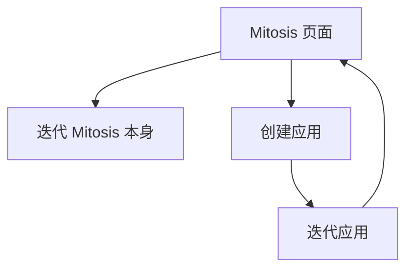

# Mitosis Overview

## 目标

Mitosis 是一个 AI 自举应用构建平台。用户通过 `mitosis.zenheart.site` 页面描述目标，平台通过 Agent 自动完成规划、编码、验证和审查部署。MVP 的核心目标是让同一个页面完成三段用户路径：匿名真实使用应用；授权后按仓库归属进入环境设置或复制到自己的仓库；当前运行实例绑定仓库的 owner 通过聊天迭代 Mitosis 本身并创建、迭代应用。

## MVP 范围

MVP 只保证最小闭环：

1. 用户访问 `https://mitosis.zenheart.site`。
2. 匿名用户在 Gallery 中打开并真实使用已部署应用。
3. 用户使用 GitHub OAuth 登录。
4. 如果登录用户没有自己的可用 `mitosis` 仓库，平台只提供应用浏览和 fork/复制到自己仓库的指引。
5. 如果登录用户拥有自己的 `mitosis` 仓库，进入初始化配置：GitHub OAuth App、Cloudflare Worker、StepFun token。
6. owner 在 Workspace 聊天窗口描述 Mitosis 自身迭代、应用创建或应用迭代目标。
7. Workspace 对不清楚的需求先澄清，再创建 GitHub Issue。
8. GitHub Actions 只接受仓库 owner 创建或批准的 IssueOps 请求。
9. Claude Code 构建应用或准备平台变更。
10. verifier 通过后创建 draft PR，等待人工审查。
11. PR 合入 `master` 后发布到 GitHub Pages。
12. 新访客回到第 1-2 步使用应用；owner 回到第 5-7 步继续迭代 Mitosis 或应用。

## 三阶段用户路径

| 阶段 | 用户身份 | 行为 | 结果 |
|------|----------|------|------|
| 1. 匿名使用 | 未登录访客 | 浏览 Gallery，打开 `/apps/{name}/v{n}/` | 真实使用已部署应用 |
| 2. 登录归属判断 | GitHub 登录用户 | OAuth 鉴权并判断是否拥有自己的 `mitosis` 仓库 | owner 进入环境设置；其他用户获取 fork/复制指引 |
| 3. 聊天自举迭代 | 仓库 owner | 在 Workspace 描述平台或应用目标 | Agent Loop + verifier + draft PR + Pages 发布 |

发布后，应用重新进入阶段一；owner 可继续重复阶段二和阶段三。

## 两条自举链路

| 链路 | 入口 | 输出 | 合入方式 |
|------|------|------|----------|
| Mitosis 自身迭代 | Workspace 中描述平台变更 | 平台 Issue / PR | owner 审查后合入 `master` |
| 应用创建和迭代 | Workspace 中描述新应用或 `?ref=` 继续开发 | `apps/{name}/v{n}` PR | owner 审查后合入 `master` |

## 非 MVP

以下能力不阻塞 MVP：

- 每个应用复制完整平台运行时。
- 独立仓库 per app。
- 模板市场。
- 多 LLM 动态选择。
- 服务端运行时、数据库、自定义域名等云服务扩展。

## 自举闭环

自举在 MVP 中是页面驱动的产品闭环，不是完整平台复制。CI/CD 永远在主仓库运行。

## 核心约束

| # | 约束 | 说明 |
|---|------|------|
| 1 | **安全第一** | 所有 Token 和隐私信息充分利用 GitHub 原生能力（Secrets、加密仓库、OAuth），平台不持有任何用户敏感数据，杜绝泄露风险 |
| 2 | **自迭代优先** | Mitosis 可基于自身构建新版本，实现自举迭代，平台自身的改进也通过自举闭环完成 |
| 3 | **纯 GitHub 驱动** | 完全依托 GitHub 原生能力：Issue 管理任务、GitHub Actions 执行 Agent 循环、GitHub Pages 部署，不引入外部基础设施 |
| 4 | **版本化部署** | 每次迭代构建生成新版本（v0, v1, v2...），不覆盖已有版本。`/apps/{name}/v{n}/` 可访问历史版本 |
| 5 | **初始化可扩展** | 阶段二初始化配置是可扩展的。MVP 配置 GitHub OAuth、Cloudflare Worker 和 StepFun token，后续可在此环节选择接入云服务（服务端运行时、数据库、存储、自定义域名等），让 Mitosis 构建的应用具备后端能力 |
| 6 | **自愈与恢复** | 构建失败会把 verifier 摘要带入下一轮 Agent Loop；通过前不能创建 PR 或部署 |
| 7 | **访客可用** | 未登录用户可直接访问已部署的应用并正常使用，登录后才具备创建/修改能力 |
| 8 | **GitHub + StepFun 全栈能力利用** | 充分利用 GitHub 原生能力（OAuth、Actions、Pages、Secrets、API）与 StepFun 全栈能力（Step 模型、Agent 工具链、MCP 等）的组合，不拘泥于单一 API 调用。平台能做什么，Mitosis 就用什么，持续关注 [StepFun 文档](https://platform.stepfun.com/docs/zh/step-plan/overview) 中新能力的发布 |
| 9 | **自迭代扩展** | MVP 阶段聚焦纯 Web 应用跑通最小闭环，后续通过在初始化环节添加服务端/运行时/部署目标等配置，Mitosis 可自主构建扩展自身能力的版本。自举闭环不仅构建应用，也构建平台自身 |

## 项目起源

Mitosis 诞生于 **候鸟 AI 创造局**（StepFun 开发者活动，2026/6/16–6/28）的背景下。

作为活动参与者，领取到 Step 3.7 Flash 调用额度后，我带着两个明确的目标开始：

1. **证明自己使用 AI 的能力**：不满足于做一个能跑的 demo，而是用 AI 端到端地完成一个复杂项目的设计、编码和部署，展示完整工作流。探索 Agent 的边界到底在哪里？
2. **打造 StepFun 官方 Showcase**：构建一个足够有深度和价值的产品，充分压测 StepFun 的模型在 Agent 下的能力边界，作为候鸟 AI 创造局的 showcase 作品提交。

Mitosis 就是这样诞生的。
